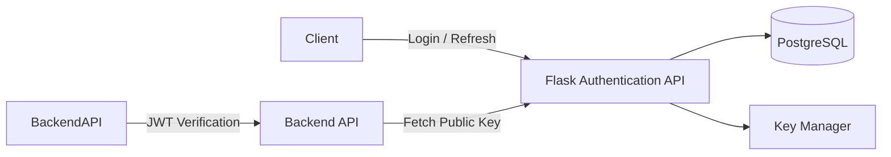
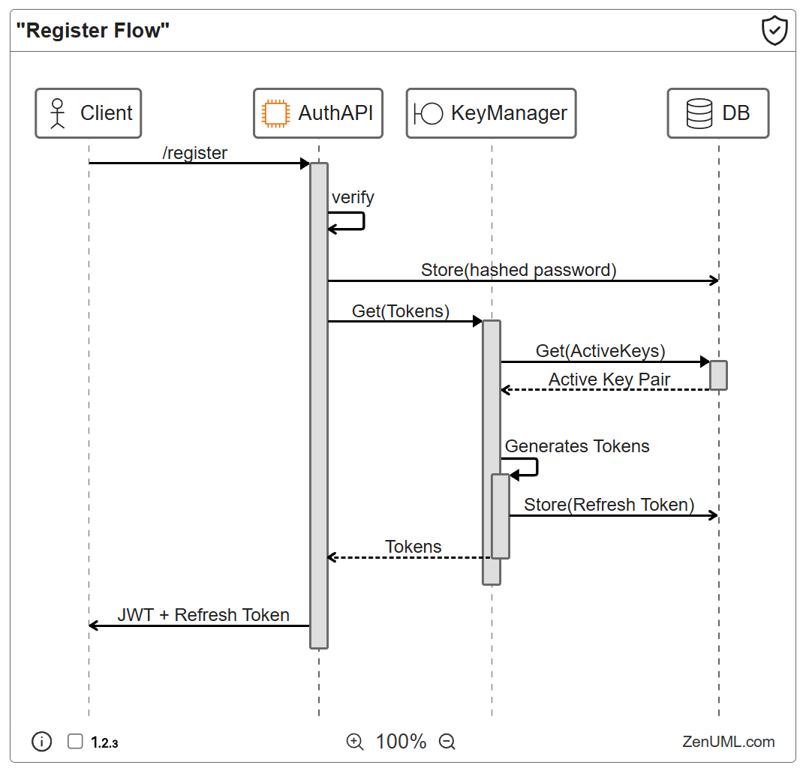
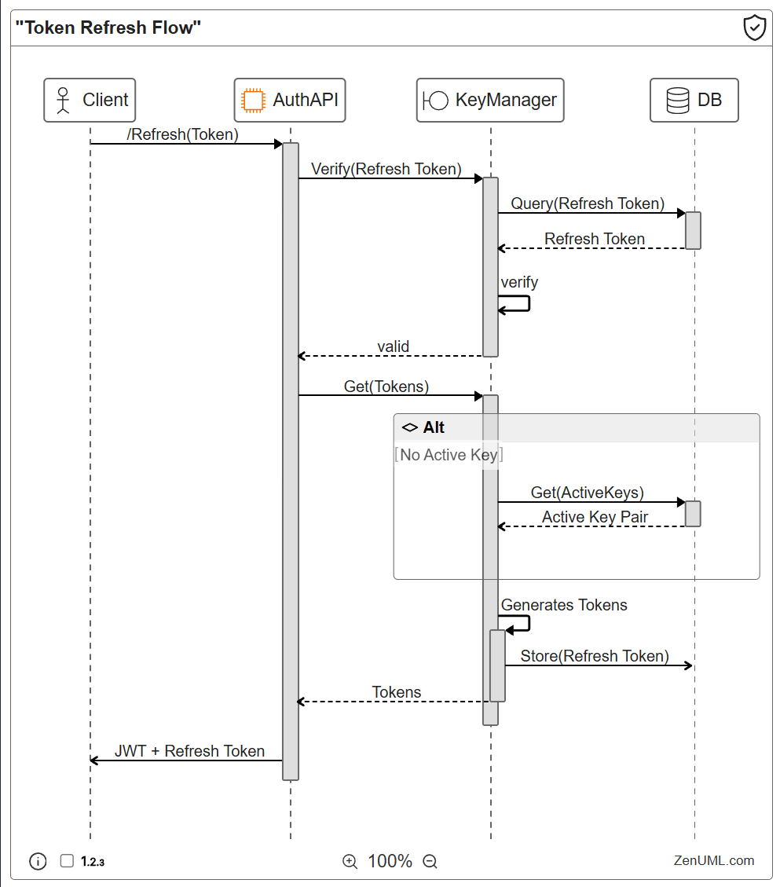
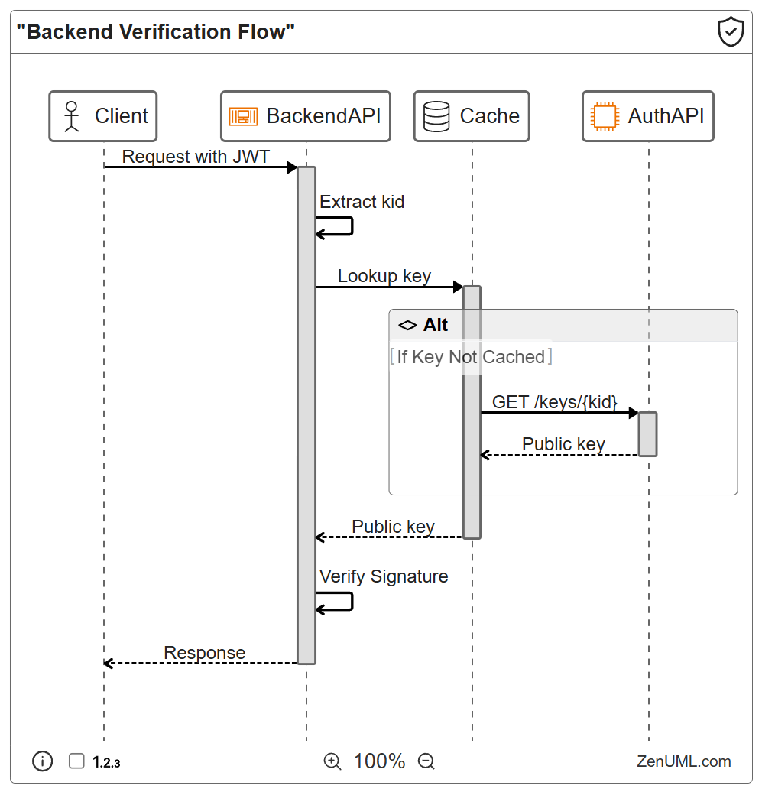
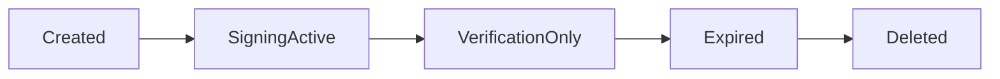

# Flask_Authentication_API

A dedicated authentication and token issuance service built with Flask and PostgreSQL, designed to provide secure identity verification for distributed backend APIs using short-lived JWT access tokens and long-lived refresh tokens with asymmetric key rotation.

---

# Overview

Flask_Authentication_API is responsible for:

* User registration and authentication
* Secure password storage using Argon2 with peppering
* Issuing JWT access tokens
* Issuing refresh tokens with rotation protection
* Managing asymmetric signing keys (Ed25519)
* Providing public keys to backend services for token verification
* Session control and revocation
* Secure key lifecycle management

The service enables backend APIs to verify authentication locally without tight coupling to the authentication database.

**Please check out the future plans as well [Future Plans & Roadmap](docs\FUTURE_PLANS.md)**

---

# Architecture

---

# Core Features

## Authentication

* User registration (email, username, password)
* User login verification
* Logout with token revocation
* Multiple concurrent sessions
* Configurable maximum session limits

## Token System

Two-token architecture:

### Access Token (JWT)

Purpose:

* Authenticate requests to backend APIs

Characteristics:

* Signed using Ed25519
* Short-lived (6 minutes)
* Stateless verification
* Contains signing key identifier (`kid`)

### Refresh Token

Purpose:

* Obtain new access tokens without re-authentication

Characteristics:

* Long-lived (181 days)
* Stored server-side
* Rotated on use
* Prevents branching refresh chains

---

## Register Flow

`KeyManager` is an integrated process of `AuthAPI`

On the first request after startup, it requests the active key from the database. If none exists, it generates a new key pair and stores it. This ensures that there is always an active signing key available for token issuance.

---

## Token Refresh Flow

If the signing key is not active or invalid, the `KeyManager` will automatically generate a new key pair and update the database. This allows for seamless key rotation.

---

## Backend Verification Flow

Backend services verify tokens locally using public keys.

## [**Click here for Interactable Diagrams**](https://app.zenuml.com?id=item-quPYrCPJkT&share-token=1e4f5be3bea603b97fff622ec9ebb5e9&v=50719599c453ea6bdbebf338a5356fc2)

---

## Password Security

Password storage pipeline:

1. Password combined with pepper
2. Argon2 hashing
3. Salt embedded automatically by Argon2
4. Pepper ID prefixed to stored hash (planned full support)

Benefits:

* Resistant to rainbow tables
* Resistant to GPU cracking
* Supports future pepper rotation

---

# Key Management System

The service uses asymmetric Ed25519 signing keys managed by a dedicated key handler.

Each key record contains:

* Public key
* Private key (encrypted PEM)
* Creation timestamp
* Signing deactivation time
* Verification deadline
* Absolute expiration
* Active status
* Key identifier (`kid`)

Private keys are encrypted at rest.

---

# Key Lifecycle

Key lifecycle uses staged deprecation to allow safe rotation.

## Lifecycle Phases

### Signing Active

Duration: 72 hours

* Private key signs new tokens
* Public key verifies tokens

### Verification Only

Duration: up to 182 days

* Private key no longer signs
* Public key still valid
* Allows refresh token validation

### Expired

After 1 year:

* Key unusable
* Can be deleted or archived

---

# Token Lifetimes

## Access Token

| Property     | Value           |
| ------------ | --------------- |
| Lifetime     | 6 minutes       |
| Algorithm    | EdDSA (Ed25519) |
| Verification | Stateless       |

## Refresh Token

| Property | Value       |
| -------- | ----------- |
| Lifetime | 181 days    |
| Rotation | Yes         |
| Stored   | Server-side |

---

# Session Management

The system supports multiple sessions per user while preventing refresh token replay attacks.

Features:

* Multiple simultaneous logins
* Configurable session limits
* Refresh token rotation
* No branching token chains
* Logout revocation

---

# Secrets Management

Sensitive material is protected using layered controls:

* Private keys encrypted using PEM encryption
* Encryption secrets managed by a secret manager
* Database credentials isolated from application logic

---

# Database

Primary storage: PostgreSQL

Stores:

* Users
* Password hashes
* Refresh tokens
* Signing keys metadata
* Session information

---

# Security Design Principles

The system follows several security best practices:

* Short-lived access tokens
* Asymmetric cryptography
* Key rotation with staged deprecation
* Stateful refresh tokens
* Encrypted secrets at rest
* Separation of authentication from application services
* Defense against token replay
* Session control limits

---

# Limitations

Current known limitations:

* Minimal JWT claims (roles and permissions not yet implemented)
* Global pepper instead of rotating peppers
* JWT revocation list not implemented
* Password change does not yet revoke sessions
* No multi-factor authentication
* Limited monitoring and observability
* No anomaly detection or rate limiting
* Refresh token metadata is minimal
* No role-based expiry policies

These limitations are intentional early-stage tradeoffs and planned for future development.

---

# Deployment Notes

Recommended deployment environment:

* Python 3.x
* Flask
* PostgreSQL
* Secret manager for encryption keys
* HTTPS enforced at reverse proxy
* Containerized deployment preferred

---

# Design Goals

This project aims to provide:

* A secure authentication foundation
* Distributed verification capability
* Expandable authorization model
* Enterprise-style key lifecycle management
* Clear separation of identity and business APIs

---

# Status

Active development.

Future features and architectural plans are documented separately.

---
